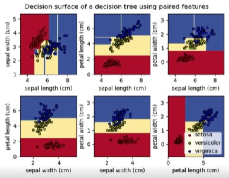
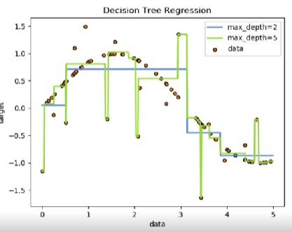
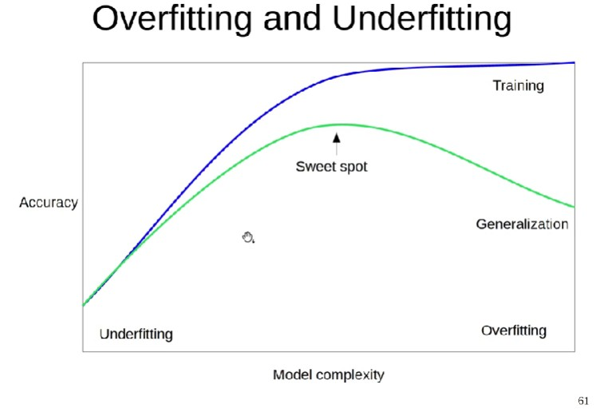

## 5.3 내용 정리
---
### 지도학습
(Decision Trees)
1. 분류
 

 
ex. 당뇨병 여뷰, 리뷰 추천(비추천), 스팸메일 여부

 
2. 회귀
  

 
ex. 원유가격, 서버의 트래픽 양, 광고의 클릭률

 

### 비지도학습
1. 군집화
2. 차원축소

 

 

- 학습한 모델을 측정할 때는 낮게 나올 수도 높게 나올 수도 있는데 정확도가 낮게 나오면 학습을 덜 한 것이다.   
- 테스트 데이터에서 어느 순간 성능이 떨어지는 순간이 있을거임. (overfitting 상태이다.)
- sweet spot를 찾는 것이 중요함.

 

### Sweet spot 찾는 법
1. Decision Trees
2. Randomized Parameter Search

